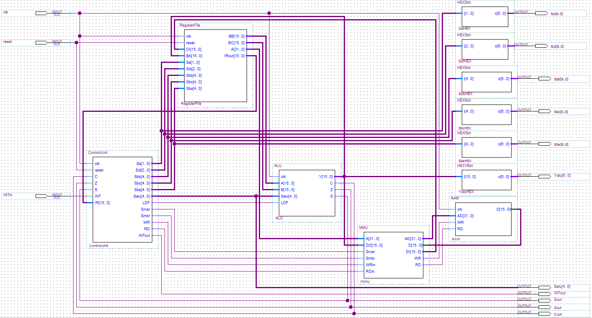
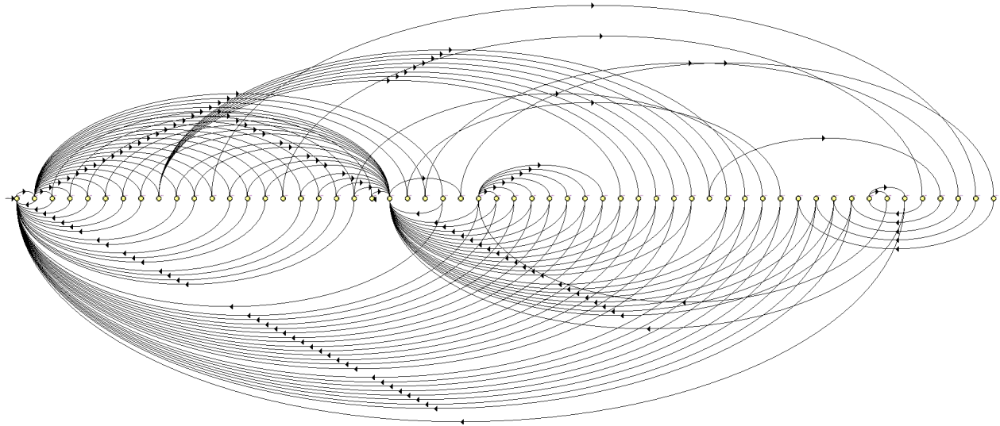
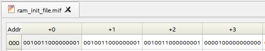
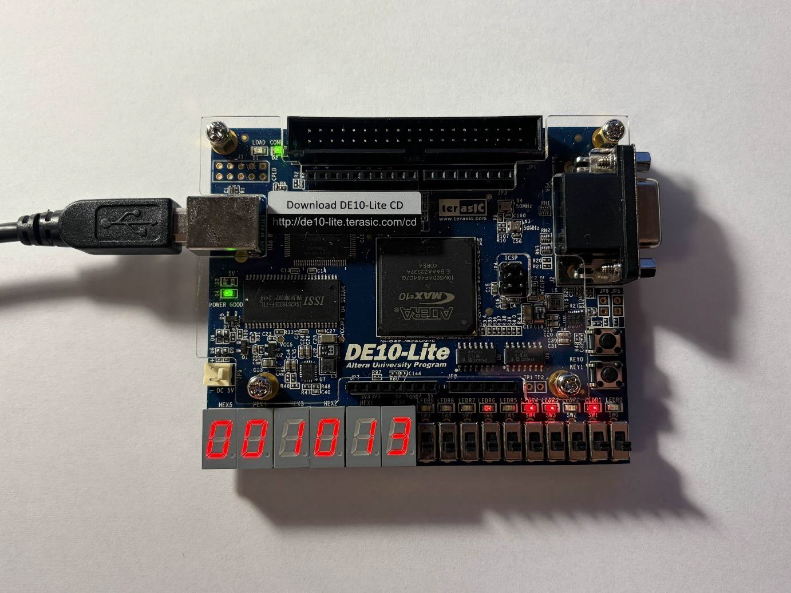

# 16-bit CPU Design and Implementation on FPGA

## Project Description and Characteristics

The goal of this project was to design and implement a custom 16-bit Central Processing Unit (CPU) architecture using the VHDL hardware description language. The system is deployed on an Intel/Altera MAX 10 FPGA.

**Full Documentation:** [CPU16bit-FPGA-Altera-MAX10.pdf](CPU16bit-FPGA-Altera-MAX10.pdf)

The processor features a multi-cycle architecture managed by a complex control unit. The design includes the following key characteristics:
* **Data Bus:** 16-bit width.
* **Address Bus:** 32-bit width.
* **ALU:** Performs 20 distinct arithmetic and logical operations, generating status flags (Carry, Zero, Sign).
* **Register File:** Contains 16 general-purpose registers (R1-R16) and special-purpose registers including the Instruction Register (IR), Program Counter (PC), Stack Pointer (SP), Address Register (AD), and Temporary Register (TMP).
* **Memory:** 2 KB of Synchronous RAM (1024 x 16-bit words).

## Integrated System Structure

The system is constructed by integrating individual modules (ALU, Register File, MMU, Control Unit, RAM) into a single top-level entity. The internal buses handle data transfer between these components.

## Control Unit State Machine

The core of the processor is a Finite State Machine (FSM) consisting of **56 states**. This unit manages the Fetch, Decode, and Execute cycles, orchestrating the operation of all other modules based on the instruction currently in the Instruction Register.

## Example Operation

The processor memory is initialized using a Memory Initialization File (MIF). The example below demonstrates a test program loaded into the RAM.

**Source File:** [ram_init_file.mif](CPU16bit-FPGA-Altera-MAX10/ram_init_file.mif)

**Program Instructions:**
The program performs a triple increment of the temporary register and then enters a wait state.
1. `0010011000000001` - `INC TMP`: This instruction increments the value stored in the TMP register by 1.
2. `0010011000000001` - `INC TMP`: Increments TMP again.
3. `0010011000000001` - `INC TMP`: Increments TMP for the third time.
4. `0000100000000000` - `WAIT`: Puts the processor into a waiting state, halting further execution until an interrupt occurs.

**Hardware Result:**
The image below shows the physical implementation on the FPGA board after executing the program. The 7-segment display shows the value `3` (result of three increments) and the status of internal control signals.

## Hardware

**Development Board:**
* Terasic DE10-Lite (Intel MAX 10 10M50DAF484C7G FPGA)

## Software

**Development Environment:**
* Intel Quartus Prime Lite Edition 23.1.1
